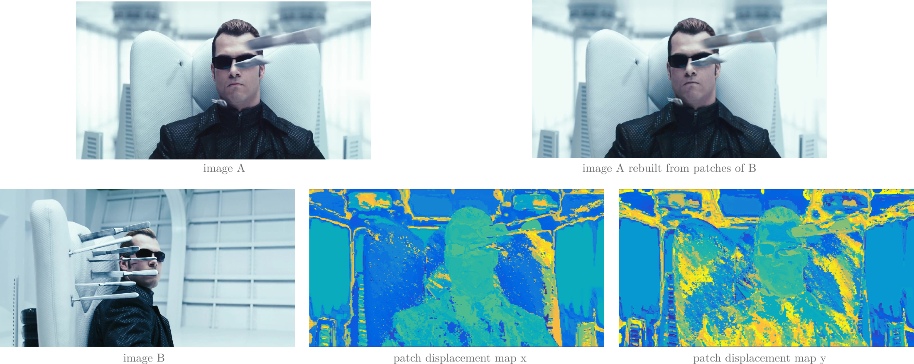

## PatchMatch algorithm

### Overview 

MATLAB/C-Mex re-implementation of paper:    [Web page](https://gfx.cs.princeton.edu/pubs/Barnes_2009_PAR/)
```
@inproceedings{barnes2009patchmatch,
  title={PatchMatch: A randomized correspondence algorithm for structural image editing},
  author={Barnes, Connelly and Shechtman, Eli and Finkelstein, Adam and Goldman, Dan B},
  booktitle={ACM Transactions on Graphics (ToG)},
  volume={28},
  number={3},
  pages={24},
  year={2009}
}
```

- Dense patch matching from an image A -> B and reconstruction of the image A with the correspondences in B




### Execution

```
run main.m
```


### Data

133 pairs of HD 1080p images are extracted from cinema movies in the *VidPairs dataset* available [here](http://www.cs.haifa.ac.il/~skorman/CSH/index.html) 
